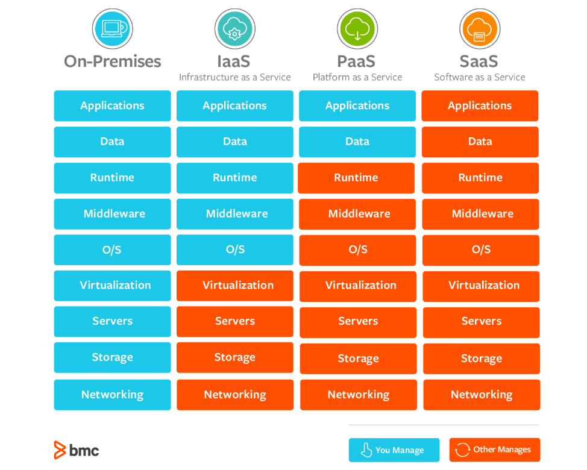
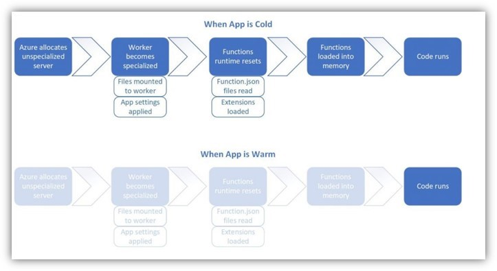

# Azure-App-Service-Availability-Part1

**App Services** is a **Platform as a Service** offering, where both the Cloud Service Provider and the Consumer share the responsibility and accountability. The CSP (in this case Azure) manages the platform, the OS upgrades, scaling, and load balancing. This leaves the consumer with more room to focus on the application and data.

  
 

 

 

Having said that, there are some recommended practices that we as the owner of the applications can take to make them more resilient and highly available – 

To begin with, we can host our applications on multiple instances to ensure the availability of the application. It is always important to ensure enough compute resources have been allocated for the application to enable smooth performance, even at the times of heavy load.

But how do we ensure that? 

The **Auto scale feature** with Azure allows us to do the magic here.

We can choose to scale horizontally(adding/removing instances that run the service) or vertically(increase/decrease the capacity of the instances that run the service). In regards with Azure App Service, the necessary scale actions can be taken based on the conditions you choose.

Now that we have made sure that the compute resources would be allocated/deallocated according to the demands of the situation; would it not be nice if the Application performance can also be enhanced?

The easiest and often ignored problem is Cold Start. What’s important to understand is that these  compute resources can get deallocated in case of application inactivity; that is, if no requests have been made to the App Service for over 20mins, and the existing instance is not busy processing the earlier requests – the instance would be freed up (deallocated). When this happens, cold start condition may surface. 

Hence, Cold start is a term used to describe the delay in the first request made to an application upon startup. One of the most common reasons for cold start is the automatic instance deallocation that we discussed earlier. Therefore, idleness of the application causes latency and in turn affects the performance.

  
 

 

 

The easiest way out is, to make use of the **AlwaysOn** feature. A web app can time out after **20 minutes of inactivity**. Only requests to the actual web app reset the timer. Therefore the AlwaysOn feature would help keep the app loaded even when there's no traffic. With the Always On feature, you can’t control the endpoint. It always sends a request to the application root.

If you wish to customize the path that receives the warmup request, you can make use of the Application Initialization Module. This process doesn’t make the startup process faster, but starts the process sooner.  The fun part is: when making use of scaling within Azure Apps, this mechanism can be used to warmup the specific new azure app service instances.

With Azure enhancing daily, there also comes the concept of pre-warmed up instances with Azure Functions. In the Premium plan, you can have your app pre-warmed on a specified number of instances, up to your minimum plan size. Pre-warmed instances also let you pre-scale an app before high load. As the app scales out, it first scales into the pre-warmed instances. Additional instances continue to buffer out and warm immediately in preparation for the next scale operation. By having a buffer of pre-warmed instances, you can effectively avoid cold start latencies. Pre-warmed instances is a feature of the Premium plan, and you need to keep at least one instance running and available at all times the plan is active.

In case your application is highly critical – it is always a best practice to geo replicate the application. This can help prepare in advance from any unforeseen calamities and natural disaster.  There are already well elaborated article on how we can consume these networking components with App Services – 
* [Using Azure Front Door with App Services](https://www.e-apostolidis.gr/microsoft/azure/securely-scale-your-web-apps-with-azure-front-door/)
* [Controlling App Service Traffic with App Services](https://docs.microsoft.com/en-us/azure/app-service/web-sites-traffic-manager)

With Part-2 we will also dive further into how Azure App Service maintains platform uptime.

# References:

* [IaaS,PaaS and SaaS](https://www.bmc.com/blogs/saas-vs-paas-vs-iaas-whats-the-difference-and-how-to-choose/) -Picture
* [Understanding Cold Start](https://azure.microsoft.com/en-in/blog/understanding-serverless-cold-start/)
* [App Init Concepts](https://blog.baslijten.com/warmup-your-application-on-azure-app-service-when-scaling-up-and-swapping-slots-using-application-initialization/)
* [App Init with Azure App Service](https://docs.microsoft.com/en-us/azure/app-service/deploy-staging-slots)
